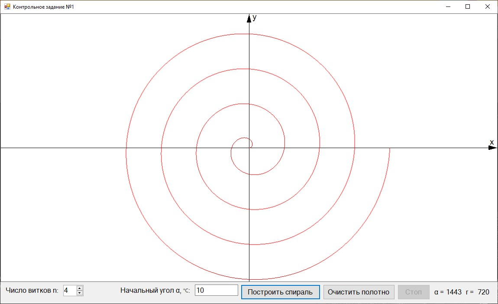
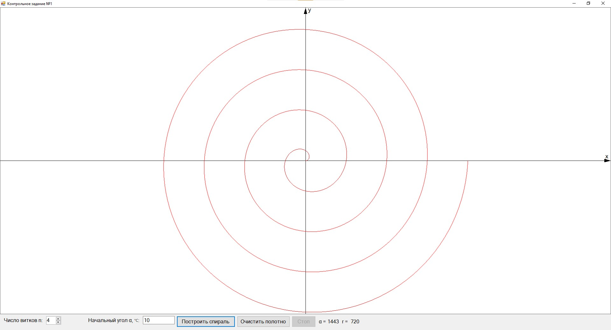

# CompGraphics_Tasks
Лабораторные работы по компьютерной графике

## Task1
Программа, строящая график спирали с заданным числом витков и начальным углом к положительному направлению оси X. 
Спираль строится в реальном времени.
Реализовано динамическое масштабирование изображения

**Пример использования:**

После масштабирования:

