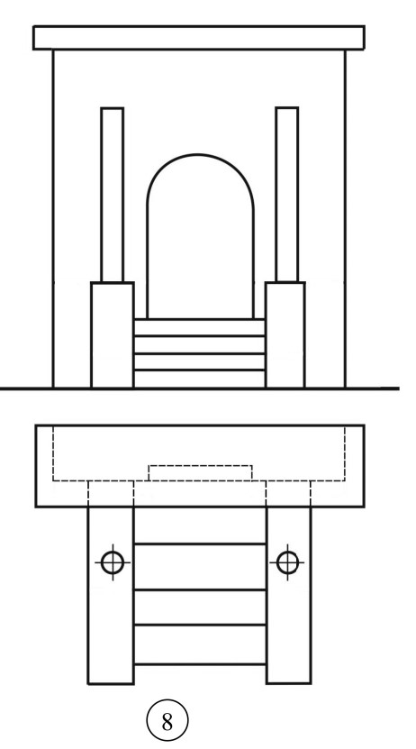
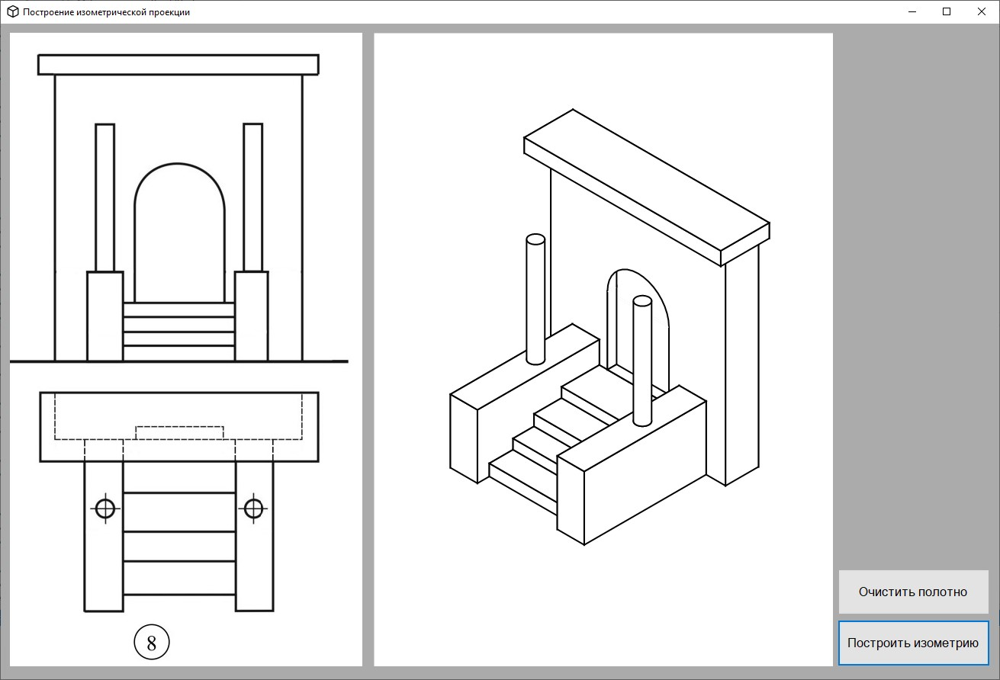

# CompGraphics_Tasks
Лабораторные работы по компьютерной графике

## Task1
Программа, строящая график спирали с заданным числом витков и начальным углом к положительному направлению оси X. 
Спираль строится в реальном времени.
Реализовано динамическое масштабирование изображения

**Пример использования:**

После масштабирования:

## Task2
Программа, строящая изометрическую проекцию модели по заданным двум видам: сверху и спереди.

**Заданные виды:**

**Построение изометрии в программе:**

